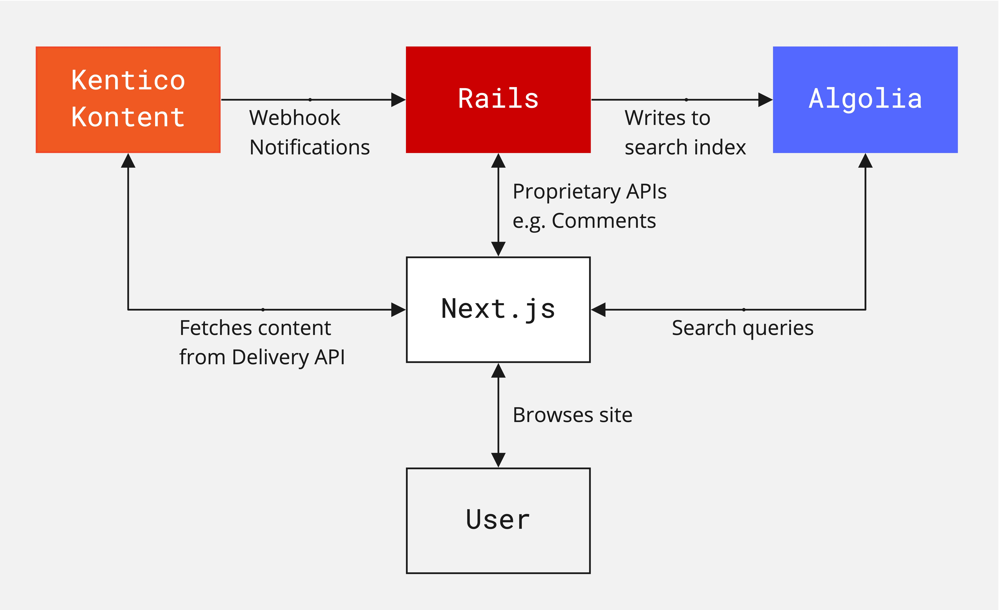

# Algolia, Kontent, Next.js & Rails Blog Demo

A demo application showcasing how [Algolia](https://www.algolia.com/) can be used by [Next.js](https://nextjs.org/) and [Ruby on Rails](https://rubyonrails.org/) to deliver a fast, relevant & engaging search experience on top of headless content from [Kentico Kontent](https://kontent.ai/).


## System Architecture

Our demo application is a blog. We have a Next.js project as our web front end, which fetches content from the Kentico Kontent headless CMS, speaks to a Rails API for additional functionality (e.g. comments), and integrates Algolia’s Instant Search to provide the search UI.



Kontent emits webhook notifications as content changes are published, Rails sits in the middle to listen for those webhook notifications, extract the content relevant to the search, then push that to Algolia.


The Rails API application is present at the root of the repository. The Next.js application can be found in the [`client/`](./client) directory.

## Requirements

- [Ruby 3](https://www.ruby-lang.org/en/downloads/)
- [Node.js 16](https://nodejs.org/en/download/)
- [Yarn](https://yarnpkg.com/)
- [PostgreSQL 13](https://www.postgresql.org/download/)
- An [Algolia](https://www.algolia.com/) account.
- A [Kentico Kontent](https://kontent.ai/) account.
- An [ngrok](https://ngrok.com/) account (if working locally).

## Setup

### Clone the project

Clone the project from [tommarshall/algolia-kontent-next-js-rails-demo](https://github.com/tommarshall/algolia-kontent-next-js-rails-demo).

```sh
git clone git@github.com:tommarshall/algolia-kontent-next-js-rails-demo.git
cd algolia-kontent-next-js-rails-demo/
```

Scaffold the Rails environment configuration file.

```sh
cp .env.sample .env
```

### Create a new Algolia application

Create a new application in [Algolia via the web Dashboard](https://www.algolia.com/dashboard).

Update the `.env` with the 'Application ID' and 'Admin API Key' from the API Keys section in Algolia.

```sh
ALGOLIA_APPLICATION_ID=<your value here>
ALGOLIA_API_KEY=<your value here>
```

### Create a new Kontent project

Create a new, empty project in [Kontent via the web UI](https://app.kontent.ai/).

### Configure the Kontent webhook

If we working locally, use ngrok to create a public URL with a tunnelled connection to the rails port on your local machine.

    ngrok http 3000

Create a new webhook in the project via the Kontent project settings with the URL address set to the webhook handler, e.g.

```sh
https://2fcbbaf8f4ce.ngrok.io/webhooks/kentico
```

Update the `.env` with the Project ID and the generated webhook Secret from Kontent.

```sh
KENTICO_PROJECT_ID=<your value here>
KENTICO_WEBHOOK_SECRET=<your value here>
```

### Run the Rails API app

Setup and start the Rails API application.

    bin/setup
    rails s


### Install the Next.js app packages

Install the Next.js node modules via yarn.

```sh
# in client/
yarn install
```

### Import the demo dataset into the Kontent project

Import the demo project into Kontent using [`kontent-cli`](https://github.com/Kentico/kontent-cli). You'll need to enable the Management API in the project settings to generate the API key.

```sh
# in client/
yarn run kontent backup --action restore --apiKey=<your value here> --projectId=<your value here> --name="../data/kontent-blog-demo-backup"
```

### Update the Next.js Algolia config

Update the client config in the [`client/pages/index.js`](./client/pages/index.js#L11-L12) with the Algolia Application ID & Search-Only API Key from the API Keys section in Algolia.

```js
const searchClient = algoliasearch(
  '<your Application ID value here>',
  '<your Search-Only API Key value here>'
);
```

### Start the Next.js app

Finally, start the Next.js client application.

```sh
# in client/
yarn dev
```

You should now see the search UI at http://localhost:3001, any content changes published in Kontent are automatically propagated to Algolia via Rails, and you can filter the results in real-time as you type a search term and select from the faceted attributes.
